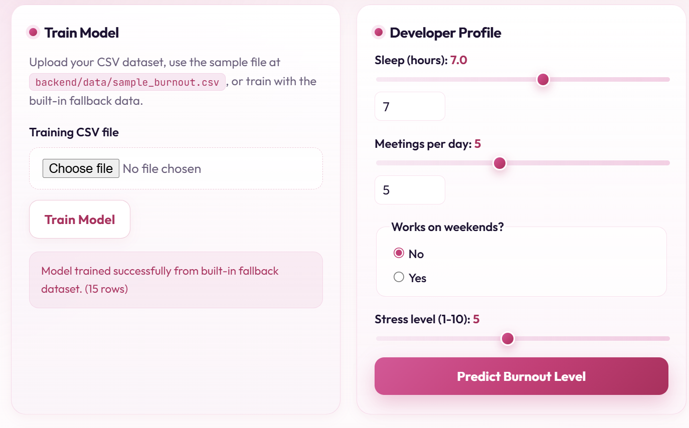
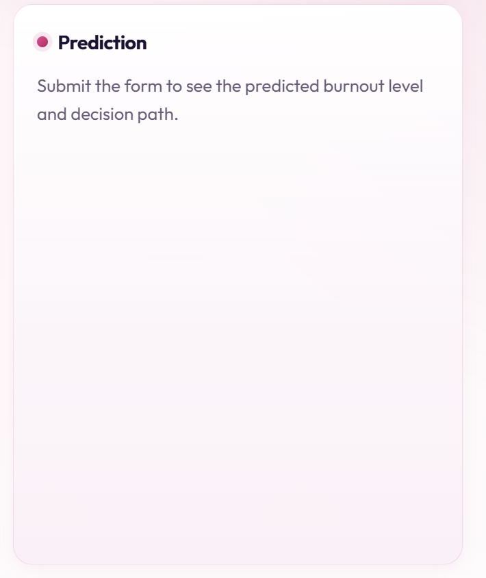
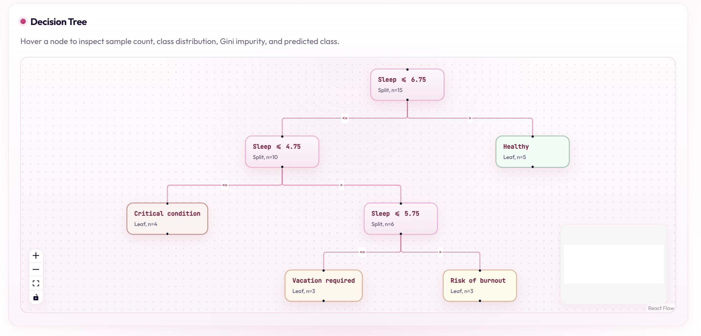

# Developer Burnout Analysis

A full-stack web application that predicts developer burnout levels using a **manually implemented CART decision tree** (Gini impurity). The dashboard lets you train a model from CSV data, submit developer profile inputs, inspect the prediction path, and explore the full tree as an interactive graph.

## Tech Stack

| Layer | Technologies |
|-------|--------------|
| Backend | Python, FastAPI, Pydantic, Uvicorn |
| Algorithm | Manual CART decision tree (no scikit-learn, TensorFlow, PyTorch, XGBoost, etc.) |
| Frontend | React, TypeScript, Vite, plain CSS |
| Visualization | React Flow (`@xyflow/react`) |

## Project Structure

```
backend/
  app/
    main.py              # FastAPI routes and CORS
    models.py            # Pydantic request/response schemas
    decision_tree.py     # Manual CART implementation
    dataset_loader.py    # CSV parsing and validation
    sample_data_schema.md
  data/
    sample_burnout.csv   # Sample training dataset (25 rows)
  requirements.txt

frontend/
  src/
    api/client.ts
    components/
      BurnoutForm.tsx
      PredictionResult.tsx
      TreeVisualizer.tsx
      Dashboard.tsx
    types/tree.ts
    App.tsx
    main.tsx
    styles.css
  package.json
  vite.config.ts
```

## How to Run the Backend

```bash
cd backend
python -m venv .venv

# Windows
.venv\Scripts\activate

# macOS / Linux
source .venv/bin/activate

pip install -r requirements.txt
uvicorn app.main:app --reload --host 127.0.0.1 --port 8000
```

Health check: [http://127.0.0.1:8000/health](http://127.0.0.1:8000/health)

Interactive API docs: [http://127.0.0.1:8000/docs](http://127.0.0.1:8000/docs)

## How to Run the Frontend

```bash
cd frontend
npm install
npm run dev
```

Open [http://localhost:5173](http://localhost:5173). Vite proxies `/api/*` to the backend during local development.

For production builds, set `VITE_API_URL` to your deployed backend URL before `npm run build`.

## Dataset Format

Create a UTF-8 CSV file with these columns:

| Column | Type | Description |
|--------|------|-------------|
| `Sleep` | number | Average sleep hours per night |
| `Meetings` | number | Calls or meetings per day |
| `Weekends` | YES/NO | Whether the developer works on weekends |
| `Stress` | number | Subjective stress level (1ÔÇô10) |
| `Target` | text | Burnout class label |

### Allowed `Target` values

- `healthy`
- `risk of burnout`
- `vacation required`
- `critical condition`

### Example CSV rows

```csv
Sleep,Meetings,Weekends,Stress,Target
8,2,NO,3,healthy
7,3,NO,4,healthy
6,6,YES,7,risk of burnout
5,8,YES,9,vacation required
4,9,YES,10,critical condition
```

Upload your CSV via the dashboard **Train Model** section or `POST /train`. If no file is uploaded, the API uses a small built-in fallback dataset for demonstration only.

A ready-made sample file is included at [backend/data/sample_burnout.csv](backend/data/sample_burnout.csv) (25 rows, all four target classes).

See [backend/app/sample_data_schema.md](backend/app/sample_data_schema.md) for the schema reference.

## Links

| Resource | URL |
|----------|-----|
| GitHub Repository | `https://github.com/YOUR_USERNAME/lotos-assignment` |
| Live Frontend | `https://your-frontend.vercel.app` *(deploy when ready)* |
| Live Backend API | `https://your-api.onrender.com` *(deploy when ready)* |
| API Docs (Swagger) | `https://your-api.onrender.com/docs` *(after backend deploy)* |

Replace the placeholder URLs above before final submission.

## Environment Variables

| Variable | Where | Description |
|----------|-------|-------------|
| `VITE_API_URL` | Frontend (build time) | Backend base URL for production builds, e.g. `https://your-api.onrender.com`. Omit for local dev ÔÇö Vite proxies `/api` to `http://127.0.0.1:8000`. |
| `CORS_ORIGINS` | Backend (runtime) | Comma-separated allowed browser origins. Default: `http://localhost:5173,http://127.0.0.1:5173`. Add your deployed frontend URL when you deploy. |

Example backend `.env` (optional, for local testing with a custom frontend port):

```env
CORS_ORIGINS=http://localhost:5173,http://127.0.0.1:5173
```

## Screenshots

Add screenshots to [docs/screenshots/](docs/screenshots/) and uncomment the lines below when ready:

<!--
### Dashboard & Developer Profile


### Prediction & Decision Path


### Interactive Decision Tree

-->

Until screenshots are added, run the app locally:

1. Start the backend (`uvicorn app.main:app --reload --host 127.0.0.1 --port 8000`).
2. Start the frontend (`npm run dev`).
3. Click **Train Model** (optionally upload `backend/data/sample_burnout.csv`).
4. Adjust sliders and click **Predict Burnout Level** to see the verdict and path.
5. Scroll to the **Decision Tree** panel ÔÇö hover nodes for sample counts and Gini values.

## Algorithm: CART Decision Tree with Gini Impurity

### What is CART?

**CART** (Classification and Regression Trees) builds a binary tree by recursively choosing the split that best separates classes. Each internal node asks a yes/no question; each leaf predicts the majority class among training samples that reach that node.

### Gini impurity

For a node with class counts \(n_1, n_2, \ldots, n_k\) and total \(N\):

\[
Gini = 1 - \sum_{i=1}^{k} \left(\frac{n_i}{N}\right)^2
\]

A split is scored by the **weighted average Gini** of its left and right child nodes. The algorithm picks the split with the lowest weighted impurity that still reduces parent impurity.

### Why CART was chosen

- **Interpretable**: Each prediction comes with an explicit decision path.
- **Inspectable**: Numerical thresholds (`Stress <= 6.5`) and categorical checks (`Weekends == YES`) map directly to the dashboard graph.
- **Educational fit**: CART with Gini impurity is straightforward to implement manually without ML libraries.
- **Mixed feature types**: Supports numeric threshold search and binary categorical splits in one framework.

### Stopping rules

Recursion stops when any of the following is true:

1. **Pure node** ÔÇö all samples share one class
2. **`max_depth`** reached (default: 8)
3. **`min_samples_split`** not met (default: 2)
4. **No useful split** ÔÇö no candidate reduces Gini impurity

### Node statistics stored in JSON

Every node includes:

- sample count
- class distribution
- predicted (majority) class
- Gini value

## API Documentation

### `GET /health`

Returns backend status.

**Response**

```json
{ "status": "ok" }
```

### `POST /train`

Trains the decision tree from an uploaded CSV (`multipart/form-data`, field name `file`) or from the built-in fallback dataset when no file is provided.

**Response**

```json
{
  "message": "Model trained successfully from uploaded CSV.",
  "rows": 25,
  "features": ["Sleep", "Meetings", "Weekends", "Stress"],
  "target_classes": ["critical condition", "healthy", "risk of burnout", "vacation required"],
  "tree": { "...": "full tree JSON" }
}
```

**Errors (400)**

- Missing/invalid CSV columns
- Empty dataset
- Invalid `Weekends` value
- Unsupported `Target` value
- Non-numeric feature values

### `POST /predict`

**Request**

```json
{
  "Sleep": 5,
  "Meetings": 8,
  "Weekends": "YES",
  "Stress": 9
}
```

**Response**

```json
{
  "prediction": "vacation required",
  "path": [
    "Stress <= 7.5",
    "Sleep <= 5.5",
    "leaf: vacation required"
  ]
}
```

**Errors (400)**

- Model not trained yet
- Invalid `Weekends` value

### `GET /tree`

Returns the latest trained tree JSON.

**Errors (400)**

- Model not trained yet

## Frontend Features

- **Train Model** panel with CSV upload or fallback training
- **Developer Profile** form with sliders/inputs for Sleep, Meetings, Stress (1ÔÇô10), and Weekends (YES/NO radio buttons)
- **Predict** button with instant burnout level result
- **Decision path** list showing each split taken through the tree
- **Interactive decision tree** (React Flow):
  - Internal nodes display split conditions
  - Leaf nodes display predicted classes with severity colors
  - Hover tooltips show sample count, class distribution, Gini, and predicted class
  - Pan/zoom controls and minimap for readability

## Assignment Requirement Checklist

| Requirement | Implementation |
|-------------|----------------|
| Python + FastAPI backend | `backend/app/main.py`, `requirements.txt` |
| TypeScript + React + Vite frontend | `frontend/` |
| No TailwindCSS | Plain CSS in `frontend/src/styles.css` |
| No ML libraries | Manual tree in `backend/app/decision_tree.py` |
| Manual CART + Gini impurity | `gini_impurity`, weighted split scoring, recursive `_build_tree` |
| Numerical threshold search | Midpoints between sorted unique values |
| Categorical/binary splits | `Weekends == YES/NO` evaluation |
| Stopping rules | Pure node, max depth, min samples, no useful split |
| Node statistics in JSON | samples, class_distribution, predicted_class, gini |
| CSV upload + user-created data | `POST /train` + `dataset_loader.py`; fallback only if no upload |
| `GET /health` | Implemented |
| `POST /train` | Implemented |
| `POST /predict` with path | Implemented |
| `GET /tree` | Implemented |
| Dashboard inputs (Sleep, Meetings, Weekends, Stress) | `BurnoutForm.tsx` |
| Prediction + decision path UI | `PredictionResult.tsx` |
| Interactive tree graph | `TreeVisualizer.tsx` |
| Leaf severity styling | CSS classes per burnout level |
| Hover node statistics | Tooltip on tree nodes |
| CORS for local dev | FastAPI `CORSMiddleware` |
| Error handling | CSV, Weekends, empty data, untrained model, invalid targets |
| Deployment-ready structure | Separate backend/frontend, env-based API URL, proxy in Vite |
| README + AI transparency | This document |

## Deployment Notes

When you are ready to deploy:

- **Backend (Render / Railway / Fly.io)**: run `uvicorn app.main:app --host 0.0.0.0 --port $PORT` from `backend/`
- **Frontend (Vercel / Netlify / Cloudflare Pages)**: set `VITE_API_URL` to the deployed backend URL, then `npm run build`
- Set backend `CORS_ORIGINS` to include your production frontend URL(s)
- Update the **Links** section above with live URLs

## Pre-Submission Audit Checklist

| Requirement | Status | Evidence | Fix needed |
|-------------|--------|----------|------------|
| Python FastAPI backend | PASS | `backend/app/main.py` | None |
| `GET /health` | PASS | `health()` in `main.py` | None |
| `POST /train` (CSV upload + fallback) | PASS | `train()` + `dataset_loader.py` | None |
| `POST /predict` with decision path | PASS | `predict()` + `DecisionTreeClassifier.predict_one()` | None |
| `GET /tree` | PASS | `get_tree()` in `main.py` | None |
| CORS for local frontend | PASS | `CORSMiddleware` in `main.py` | None |
| Clear error handling | PASS | `HTTPException`, `DatasetError` | None |
| Manual decision tree (no ML libs) | PASS | `decision_tree.py`, `requirements.txt` | None |
| Gini impurity splitting | PASS | `gini_impurity()`, `_weighted_gini()` | None |
| Numerical threshold splits | PASS | `_evaluate_numerical_split()` | None |
| Categorical YES/NO splits | PASS | `_evaluate_categorical_split()` | None |
| Stopping rules | PASS | `_build_tree()` pure/max_depth/min_samples/no split | None |
| CSV format documented | PASS | `README.md`, `sample_data_schema.md` | None |
| Model learns from Target column | PASS | `fit()` uses `row["Target"]` labels | None |
| Fallback only without upload | PASS | `train()` file check | None |
| React + TypeScript frontend | PASS | `frontend/src/*.tsx` | None |
| All profile inputs | PASS | `BurnoutForm.tsx` | None |
| Train + predict UI | PASS | `Dashboard.tsx` | None |
| Decision path display | PASS | `PredictionResult.tsx` | None |
| Interactive tree graph | PASS | `TreeVisualizer.tsx` | None |
| Node metadata on hover | PASS | `.tree-node-tooltip` in `TreeVisualizer.tsx` | None |
| Plain CSS (no Tailwind) | PASS | `styles.css` | None |
| README + API docs + algorithm | PASS | This document | None |
| AI transparency (when/how/why) | PASS | Section below | None |
| Deployment notes | PASS | Deployment Notes section | None |
| Frontend uses `GET /tree` | PASS | Restored on page load via `fetchTree()` in `App.tsx`; also available after train | None |
| Backend status indicator | PASS | `checkHealth()` wired in app header | None |
| Sample CSV in repository | PASS | `backend/data/sample_burnout.csv` | None |
| CORS env configuration | PASS | `CORS_ORIGINS` in `main.py` | None |
| GitHub / deployment links | PARTIAL | Placeholder URLs in README **Links** section | Replace before submission |
| Screenshots | PARTIAL | `docs/screenshots/` folder + README template | Add PNG files before submission |

## AI Collaboration Transparency

AI tools, including ChatGPT, Cursor, and/or Claude, were used during the development of this project as required by the assignment.

**Why AI was used:** to speed up boilerplate setup, clarify algorithm design choices, catch edge-case bugs faster, and produce clearer documentation while keeping the decision tree implementation manual and reviewable.

AI was used for the following purposes:

- **Initial planning:** to break down the assignment requirements into backend, frontend, algorithm, dataset, and documentation tasks.
- **Boilerplate generation:** to help create the initial FastAPI backend structure and React + TypeScript + Vite frontend structure.
- **Algorithm support:** to help design and debug the manually implemented CART decision tree recursion, Gini impurity calculation, numerical threshold search, categorical splits, and prediction path traversal.
- **Debugging:** to identify and fix edge cases such as empty datasets, invalid CSV values, untrained model prediction attempts, and tree traversal errors.
- **Frontend assistance:** to help structure React components, connect the frontend to the API, and improve the interactive decision tree visualization.
- **Styling:** to improve the dashboard layout and graph readability using plain CSS, without TailwindCSS.
- **Documentation:** to help write and organize the README, API documentation, dataset schema, and explanation of the CART algorithm.

All final code was reviewed and adjusted before submission. No ready-made machine learning libraries such as scikit-learn, TensorFlow, PyTorch, XGBoost, or LightGBM were used. The decision tree classifier is implemented manually in Python.
